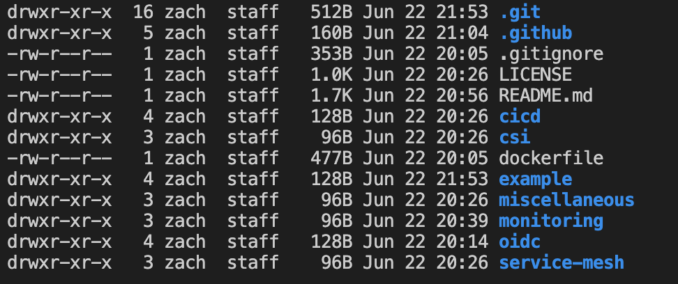
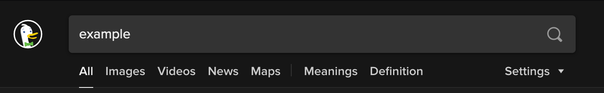
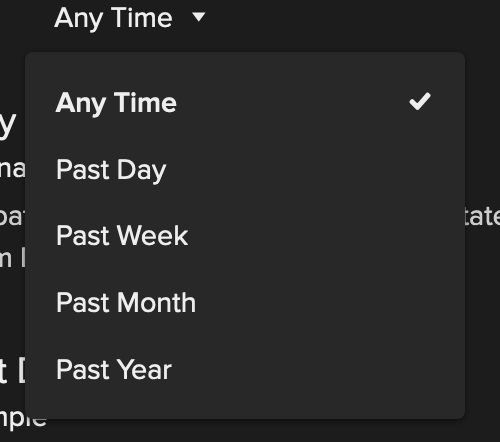

# Kubernetes + Example: An Example KoolKubernetes Formula

I am a description. This is where we explain what this formula is trying to accomplish.

## Prerequisites

For this formula, we will be leveraging the following tools:

 - [First Tool](#) - a quick description of the first tool that is being recommended.
 - [Second Tool](#) - a quick description of the second tool that is being recommended.
 - [Third Tool](#) - a quick description of the third tool that is being recommended.
 - [Platform9 Managed Kubernetes Freedom](https://platform9.com/signup/) - a pure-play open source Kubernetes that is delivered as a SaaS managed service. The Freedom plan is a zero-cost plan that offers a capacity of up to 3 clusters and 20 nodes (or 800 vCPUs), community Slack support, and built-in critical alerting. While the process is very straightforward, please refer to [the documentation](https://docs.platform9.com/kubernetes/introduction/freedom-plan-faq/) to create a Platform9 Managed Kubernetes cluster.

## Part One: Do These Things First

Before we can do Part Two, we must first do Part One. Let's walk you through what to do, and explain why we you should do it.

### Step 1: Do This Thing

Here's a quick explanation of how to do Step 1.

### Step 2: Do This Thing Next

Time to do Step 2.

### (Optional) Step 3: You Could Do This

Step 3 is optional. Let's explain why it is optional, otherwise nobody will do it, or they will do it without understanding the purpose of it.

## Part Two: Do These Things Second

Let's get into the meat of things. The content may change, but the format should stay the same.

### Step 1: Do This Thing

In this step, we're going to show some code blocks. They should always be a copy-paste ready block:

```bash
/bin/bash command
```

If there is any output, the output should be shown as a screenshot, so as not to imply that the results are something that should also be copied and pasted into their terminal:



### Step 2: Do This Thing Next

We may want to include a screenshot or two on occasion. Screenshots are kool (see what I did there?) but they can be overwhelming if overused, and aren't very accessible, so use them only when they help drive a step home:



Never put screenshots back-to-back without any context. There should always be text to explain what we just saw (and what we are about to see):



## Part Three: Trust, But Verify

It's always important to end a tutorial with an explanation with how things should look. Show some screenshots, drop in some commands. Help the reader check their work.

## Troubleshooting

Things can go wrong. Let's help people figure out how to help themselves.

### Known Issue Can Happen

Quick steps to fix it.

### Received `specific_error_message` Error

Quick steps to fix it.

## Further Reading

- [An Interesting, Related Article](#)
- [Another Interesting, Related Article](#)